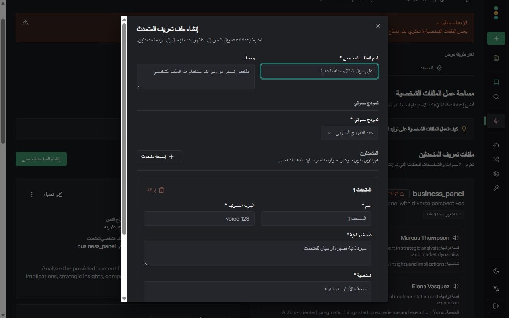

# PR #1367 — follow-up review

Application commit: `9f65c30197238380f97f1200fca7e4378329ccbe`. Tested 2026-09-20.

## Findings handled

- Chinese script preferences now map explicitly: zh-Hant and zh-Hant-HK to zh-TW; zh-Hans and zh-Hans-SG to zh-CN. Four new regression cases failed before the fix and now pass for saved and browser preferences.
- Startup and I18nProvider share one dependency-free languageToDirection helper.
- The unsupported-language test starts in French and verifies both the requested Hebrew tag and resolved English fallback. The saved-language provider test clears bootstrap metadata before mounting, so it must be actively reapplied.
- The hydration test name and comments now describe its intentional empty server placeholder. ADR-009 lists the hidden-wrapper approach under rejected alternatives.
- Corrected Arabic Generate, Ask, Collect, Manage, light/dark theme names, related podcast actions, and inconsistent speaker terminology throughout podcast labels/forms/messages.
- The missing-language-keys finding is a false positive: common.arabic and common.italian already exist in all 15 registered locales, added in 3aae4e7. Existing locale parity tests pass.

## Automated verification

| Check | Result |
| --- | --- |
| Targeted regression and locale tests | 79 passed |
| Full Linux frontend coverage suite | 215 passed, 35 files |
| Linux frontend lint | Passed, 0 errors; 7 warnings in unchanged files |
| Production frontend build and TypeScript check | Passed |
| Full linux/amd64 Docker runtime build | Passed |
| Startup script extracted from served production HTML | 20 saved/browser preference cases passed |
| Backend | Unchanged since d089f1c: 751 tests, lint and typecheck previously passed in Linux |

The build used a clean git archive. Tests and lint used the Node 22 builder with the final frontend source mounted read-only. Raw logs are in this local QA folder. Local checks do not replace upstream GitHub checks.

## Deployment and browser checks

Updated the isolated local preview at http://127.0.0.1:3138 to image `open-notebook:pr1367-9f65c30`. The real API, worker and disposable QA database are running. No upstream merge or production deployment was performed.

- Arabic reload preserves ar-SA/rtl.
- Podcast profiles and the speaker form show consistent المتحدث terminology; light/dark theme menu entries read فاتح and داكن.
- Selecting Traditional Chinese and reloading produces zh-TW/ltr with translated content. Simplified Chinese produces zh-CN/ltr. Switching back to English succeeds.
- Browser warning/error queries returned no entries.
- Existing phone layout limitations documented in earlier test notes are unchanged. No AI generation was run.

