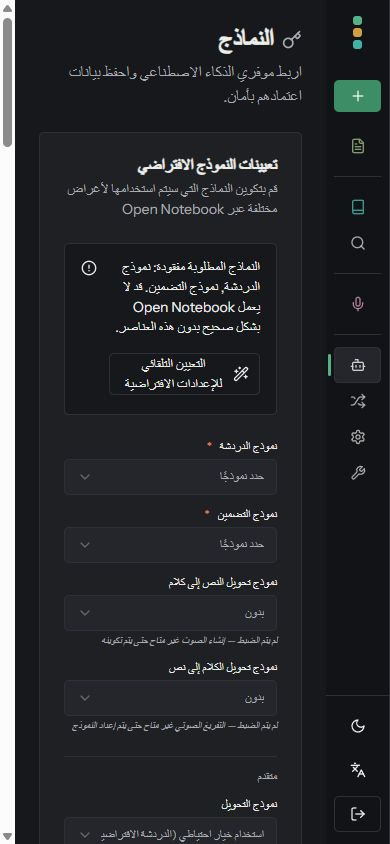
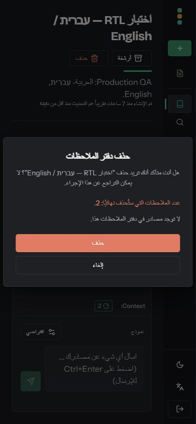
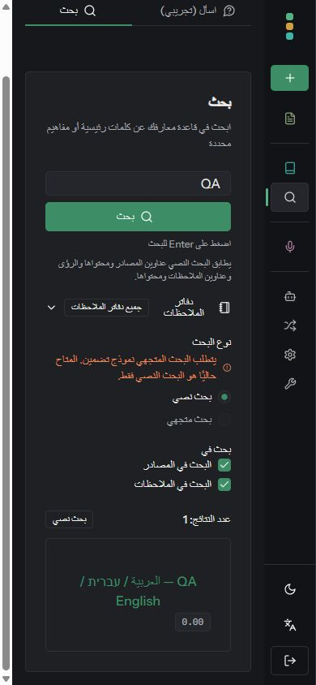
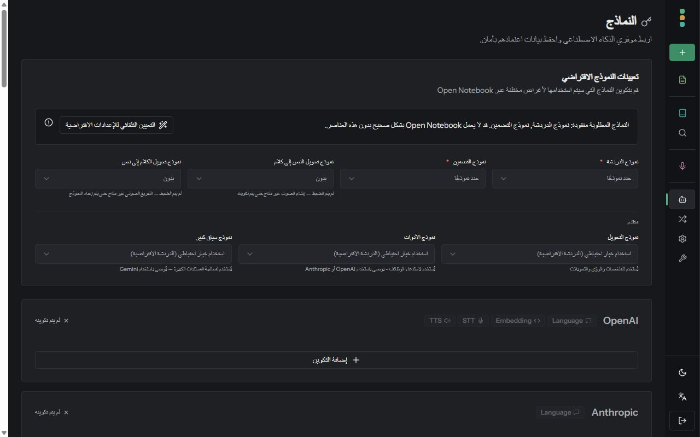
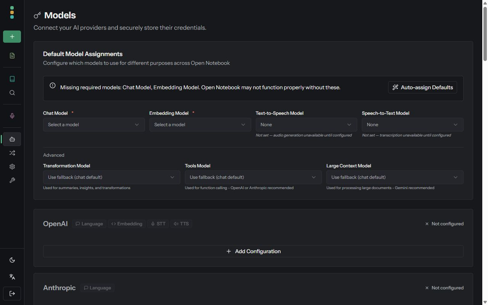

# Arabic localization audit — PR #1367

Reviewed all 948 Arabic translation entries against their English meanings and checked ambiguous labels in their UI call sites. Corrected 254 entries, including notebook terminology, action/state labels, podcast profiles and generation, model descriptions, upload/download wording, and product names. Source commits: `f2d3ffd` (copy and tests), `3575b58` (mobile model settings).

Count labels use `عدد …: {{count}}` (number of …), which does not put an inflected noun after the numeral. This handles one, two, zero and larger counts without adding redundant plural keys to every locale. Podcast episode sentences retain their six Arabic plural forms. Placeholder omission is allowed only for the three explicitly worded Arabic episode forms; other locales and keys stay strict, and `{count}` typos are rejected even in those exceptions.

## Automated checks

- 320 frontend tests passed across 35 files in Linux, including 60 new count-output cases and 13 placeholder-guard regression cases.
- Locale key and placeholder parity passed across all 15 locales.
- Frontend lint: 0 errors, 7 existing warnings outside the changed files.
- Fresh production Docker build and TypeScript checks passed at `3575b58`.
- The startup script extracted from the built HTML passed 20 saved/browser-language cases, including `ar`, `ar-SA`, Chinese script tags and fallback preferences.
- QA API health check passed. The running app uses the final production image.

## Manual browser checks

- Arabic selection and reload: `ar-SA` / `rtl`; returning to English: `en-US` / `ltr`.
- Notebook creation form: corrected notebook description placeholder and readable mobile dialog.
- Notebook deletion preview: real two-note count shown correctly; cancelled without deleting.
- Text search for the existing mixed-language QA note: one result, `عدد النتائج: 1`.
- Podcast profile terminology, speaker backgrounds, generation descriptions and singular episode usage inspected in the UI.
- Transformations tabs: Arabic ArrowLeft and English ArrowRight move focus and selection to the second tab.
- Models: Gemini preserved; Arabic and English desktop layout checked at 1280×800. Mobile layout checked at 390×844.
- Fixed the model settings warning/button and selector overflow. The mobile main pane now has equal content and viewport widths (311px), down from 354px content in a 311px pane.
- No browser warnings or errors observed during these checks.

These checks exercise localization and interface behavior. AI generation was not exercised because the disposable QA instance has no provider credentials. A clean automated review is not a guarantee that every wording choice is beyond improvement.

## Screenshots

### Arabic model settings — mobile

### Notebook deletion preview — mobile

### Text search — mobile

### Arabic model settings — desktop

### English model settings — desktop

