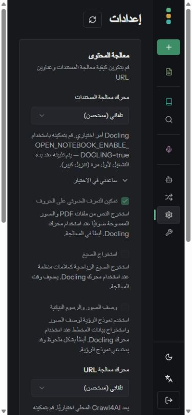
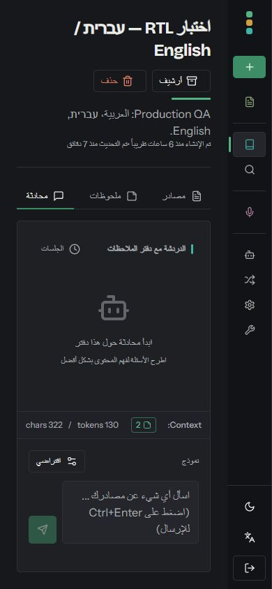
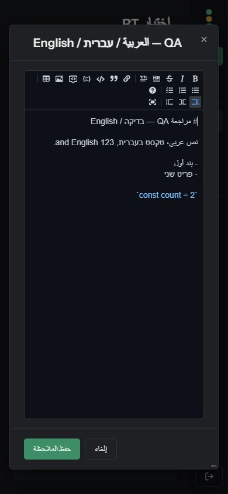
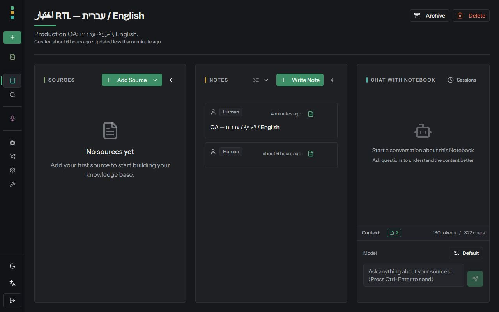

# PR #1367 — independent review and QA

Tested application commit: c743037a101763b518036dfb0c52a472b40750d7.

## Findings and fixes

- Reviewed the complete PR diff: document startup, language detection, provider hydration, Radix direction, editor integration, locale/date registration and count handling.
- Corrected Russian counts ending in 1 (21, 31, 101), Polish few-form wording, Bengali digit consistency, Arabic message/provider count text and the rebuild spelling. Episode counts now interpolate their actual number in other locales. Arabic retains natural zero/singular/dual wording.
- Kept exact locale-key parity and type checking. Placeholder parity permits only count to be expressed in words for zero/one/two forms; other placeholders and the count in few/many/other remain checked.
- Mobile inspection found clipped Settings variable names and notebook actions squeezing long titles. Added wrapping, stacked the header actions on narrow screens, and made inline text alignment follow the document direction.
- The bot's claim that zero-count tests fail was not reproducible: explicit i18next _zero entries take precedence. The actual suite passed before the fixes. The expanded assertions are based on expected translated output rather than copying the _other template.

## Verification

| Check | Result |
| --- | --- |
| Full frontend suite at final source | 247 tests passed in 35 files |
| Locale key and placeholder parity | All 15 locales passed |
| New plural assertions against previous commit | 9 failures reproduced; all pass after fixes |
| Deliberately disable document metadata updates in a disposable container | Hydration regression test failed as expected |
| Lint | Passed, 0 errors; 7 pre-existing warnings |
| Production build and TypeScript | Passed from clean git archive |
| Full linux/amd64 runtime image | Built and deployed locally |
| Startup script extracted from final served HTML | 20 saved/browser language cases passed |
| Backend | No backend diff in this PR; earlier 751-test/lint/typecheck result remains applicable |

## Manual browser checks

- Desktop: 1280 x 800. Phone: 390 x 844.
- Arabic direction persists across reloads and route changes.
- Saved a note containing Arabic, Hebrew, English, a Markdown heading, list and inline code. Reopened it after reload on phone; content persisted. Live editor panes remain separate; edit-only mode also works.
- Phone RTL tabs: ArrowLeft moved Sources to Notes. After switching to English, ArrowRight moved Sources to Notes with lang=en-US and dir=ltr.
- Corrected mobile Settings paragraphs have no horizontal text overflow. Long mixed-language notebook title and Archive/Delete actions now occupy separate rows on phone.
- Desktop English layout remains usable after resizing and reloading.
- Browser warning/error log was empty.

The local preview uses open-notebook:pr1367-self-review with the real API, worker and disposable QA database. No model generation was exercised. This is a frontend QA pass, not an exhaustive translation review or a replacement for upstream CI. The existing expanded-sidebar behavior on very narrow screens is outside these fixes.

## Screenshots

### Mobile Settings after wrapping fix

### Mobile notebook after header fix

### Mobile mixed-language editor

### Desktop English after switching back
