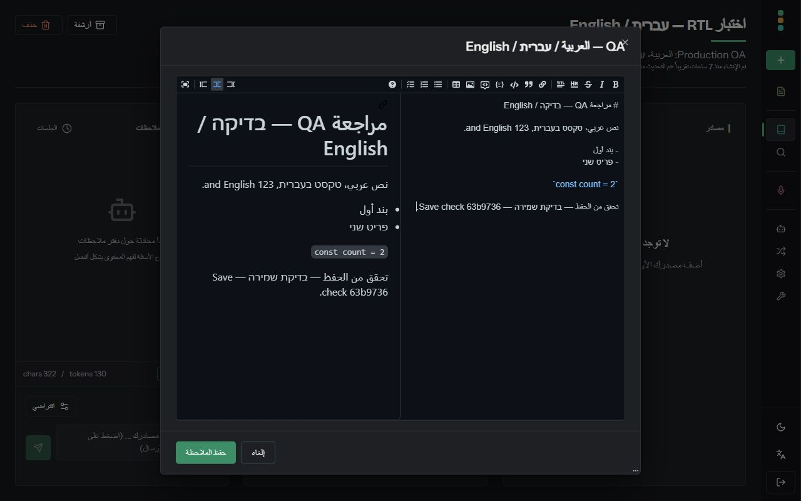
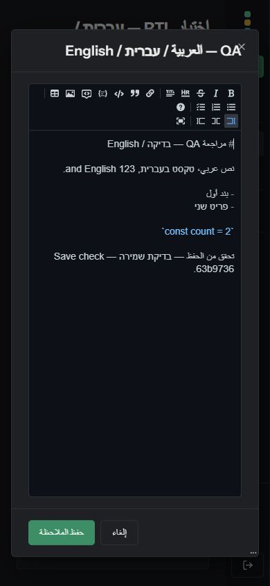

# Real Arabic worded-count tests — PR #1367

Validated commit `63b9736`. This follow-up changes only `frontend/src/lib/locales/index.test.ts`.

The zero/one/two acceptance cases now read the actual Arabic and English locale entries. They assert the distinct Arabic wording, the English count placeholder, its intentional absence in Arabic, and successful placeholder validation. The existing runtime interpolation tests continue to cover real Arabic output for all six plural categories.

## Validation

- Full frontend suite: **320 tests passed**, 35 files.
- Lint: 0 errors, 7 existing warnings outside the changed file.
- Fresh production Docker build, including TypeScript: passed.
- Built startup-script checks: all 20 saved/browser preference cases passed.
- Negative control in a disposable container: appending `{{count}}` to all three real Arabic worded forms caused **six expected failures**: the three updated data assertions and the three existing runtime interpolation assertions. The working tree and production build used the unmodified translations.
- The QA API is healthy and the app runs the newly built image on port 3138.

## Browser checks

- Arabic selection and persisted reload: `ar-SA` / `rtl`.
- Saved a mixed Arabic/Hebrew/English note with the marker `63b9736`; reloaded and confirmed all content persisted.
- Inspected the live editor on desktop (1280×800) and edit-only mode on mobile (390×844).
- Mobile tabs: Arabic ArrowLeft moves Sources → Notes; English ArrowRight moves Sources → Notes.
- English reload restores `en-US` / `ltr`.
- No browser warnings or errors observed. AI generation was not exercised in this disposable instance.

## Earlier review threads rechecked

These findings were already addressed or disproved by prior fixes and tests. They are separate from the latest worded-count test clarification.

| Thread | Evidence |
| --- | --- |
| [Decision record](https://github.com/lfnovo/open-notebook/pull/1367#discussion_r4057460324) | ADR-009 exists and documents document direction, pre-hydration metadata, Radix context and alternatives. |
| [Pre-hydration metadata](https://github.com/lfnovo/open-notebook/pull/1367#discussion_r4057460341) | Root layout runs `languageScript`; compiled script passes the preference checks. |
| [Regionless Arabic](https://github.com/lfnovo/open-notebook/pull/1367#discussion_r4057642527) | Shared resolver maps `ar` to `ar-SA`; detector and compiled-script tests pass. |
| [Missing menu keys](https://github.com/lfnovo/open-notebook/pull/1367#discussion_r4057826536) | Both keys exist in all 15 locales; parity passes. Earlier reply links concrete examples. |
| [Duplicated direction rule](https://github.com/lfnovo/open-notebook/pull/1367#discussion_r4057826562) | Provider and script both use `languageToDirection`. |
| [ADR PR number](https://github.com/lfnovo/open-notebook/pull/1367#discussion_r4057887093) | This is PR #1367. ADR references are correct; the misleading generated badge was fixed. |
| [Zero-count test failure](https://github.com/lfnovo/open-notebook/pull/1367#discussion_r4058393185) | Explicit `_zero` entries take precedence. Existing runtime tests pass for French, Portuguese and Bengali. |
| [Arabic count agreement](https://github.com/lfnovo/open-notebook/pull/1367#discussion_r4058461529) | Natural total labels avoid counted-noun agreement. 60 rendered-output cases cover the affected keys; episode sentences retain six forms. |

## Screenshots

